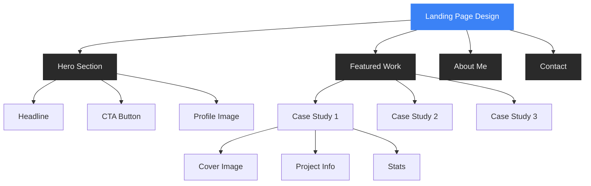

# 🛠️ The Tech Artisan - Landing Page Portfolio (Dark Mode)

## 🎨 Theme Overview

**The Tech Artisan** คือแนวคิดการออกแบบ Landing Page Portfolio สไตล์ Dark Mode ที่เน้นความเรียบหรู ดูเป็นมืออาชีพ นำเสนอผลงานและตัวตนในแบบที่ทันสมัยและมีมิติ พร้อมลูกเล่นอนิเมชั่นสุภาพ (subtle) เพื่อสร้างประสบการณ์ที่น่าประทับใจ

> **แนวคิด**: ได้แรงบันดาลใจจากความล้ำสมัยและแฟนตาซี ผสมผสานเทคโนโลยีและความเป็นศิลปิน

---

## 🎯 Hero Section

- **พื้นหลัง:** #1A1A1A พร้อม gradient & particle effect
- **Layout:** 2 ฝั่ง (ซ้ายข้อความ/ขวารูปโปรไฟล์), มือถือเป็นแนวตั้ง
- **Headline:** Satoshi Bold, 60px, #F0F0F0
- **Sub-headline:** Inter Regular, 18px, #A0A0A0
- **CTA Button:** 
    - พื้นหลัง #3B82F6, ทรงกลม, hover glow+shadow
    - มีอนิเมชั่นสั่น/เรืองแสง
- **Profile Image:**
    - โทนเย็น, border-radius: 20px, shadow สี #3B82F660

### Hero Animation ตัวอย่าง

```css
.hero-section {
  background: linear-gradient(45deg, #1A1A1A, #222222);
  animation: gradientBG 15s ease infinite;
}
@keyframes gradientBG {
  0% { background-position: 0% 50%; }
  50% { background-position: 100% 50%; }
  100% { background-position: 0% 50%; }
}
.cta-button {
  transition: all 0.3s ease;
}
.cta-button:hover {
  transform: translateY(-2px);
  box-shadow: 0 0 15px #3B82F680;
}
```

---

## 🏆 Featured Work Section

- **พื้นหลัง:** #1A1A1A
- **หัวข้อ:** Satoshi Bold, 48px, #F0F0F0
- **Grid Responsive:** Card #2A2A2A, border-radius: 20px, shadow & hover effect
- **Card Animation:** scale, highlight bar, reveal on scroll

### Case Study ตัวอย่าง

```html
<!-- Stats Box Example -->
<div class="stats-box">
  <div class="stats-number">15K+</div>
  <div class="stats-caption">ยอดอ่าน</div>
</div>
```

```css
.card {
  background: var(--section-bg);
  border-radius: var(--border-radius);
  box-shadow: 0 2px 16px #0005;
  transition: transform 0.2s;
}
.card:hover {
  transform: scale(1.03);
  border-left: 4px solid #3B82F6;
}
.stats-box {
  background: #222;
  border-radius: 14px;
  padding: 18px 30px;
  color: var(--primary-text);
  display: inline-block;
  margin-right: 12px;
}
.stats-number { color: var(--accent); font-size: 48px; font-weight: bold; }
.stats-caption { color: var(--secondary-text); font-size: 16px; }
```

---

## 💡 About Me Section

- **พื้นหลัง:** #2A2A2A + grid/pattern
- **Headline:** Satoshi Bold, 48px, #F0F0F0
- **เนื้อหา:** Inter, 18px, #A0A0A0, กล่องขอบมน/ขอบสี #3B82F6
- **ลูกเล่น:** pattern, emoji, highlight bar, grid background

```css
.about-section {
  background: #2A2A2A url('grid-pattern.svg');
  position: relative;
  overflow: hidden;
}
.about-section::before {
  content: '';
  position: absolute;
  top: -50px; right: -50px;
  width: 200px; height: 200px;
  background: radial-gradient(circle, #3B82F620 0%, transparent 70%);
  border-radius: 50%;
  opacity: 0.3;
}
.about-container {
  max-width: 700px;
  margin: 0 auto;
  padding: 40px;
  border-radius: 18px;
  background: rgba(42, 42, 42, 0.8);
  border-left: 3px solid #3B82F6;
}
```

---

## 📬 Contact Section

- **พื้นหลัง:** #1A1A1A
- **Headline:** Satoshi Bold, 48px, #F0F0F0
- **Contact Row:** Flex, ไอคอน #3B82F6, text #F0F0F0, hover/animation
- **Footer:** #444, กลางจอ

```html
<div class="contact-item">
  <div class="icon"><i class="fa fa-envelope"></i></div>
  <a href="mailto:contact@techartisan.com">contact@techartisan.com</a>
</div>
```
```css
.contact-item {
  display: flex; align-items: center; gap: 12px;
  transition: transform 0.1s;
}
.contact-item:active { transform: scale(1.1); }
.icon { color: #3B82F6; font-size: 28px; transition: filter 0.3s, transform 0.6s; }
.contact-item:hover .icon { filter: brightness(1.5); transform: rotate(360deg);}
```

---

## 🌗 Design Principles & Note

- เน้น **negative space** ให้เว็บโล่ง สบายตา
- ขอบมน/เงาบางเบาทุกองค์ประกอบ
- ใช้ accent #3B82F6 เพื่อเน้นจุดสำคัญ
- Responsive รองรับมือถือ
- ฟอนต์: Satoshi/Manrope (Headline), Inter (Body)
- ภาพ/กราฟิก: โทนเย็น, ขอบมน, ใช้ Midjourney/Figma/XD ทำ mockup
- CSS Variables (ดูตัวอย่างด้านล่าง)

```css
:root {
  --bg: #1A1A1A;
  --section-bg: #2A2A2A;
  --primary-text: #F0F0F0;
  --secondary-text: #A0A0A0;
  --accent: #3B82F6;
  --border-radius: 20px;
}
```
---

## 🗂️ Flow Diagram (Mermaid)



---

## 🚀 Tips สำหรับการใช้งานและปรับแต่ง

- ปรับแต่ง assets ให้เข้ากับธีม (ขอบมน, โทนเย็น, ไม่สดเกิน)
- เลือกใช้ animation ที่สุภาพ ไม่แย่งความสนใจจากเนื้อหา
- ออกแบบบน Figma, XD หรือใช้ Midjourney ช่วยสร้างภาพ
- ใช้ CSS/JS เพิ่มความลื่นไหล เช่น text reveal, scroll reveal, CTA glow, particle.js
- ตรวจสอบ Responsive ทุกขนาดจอ

---

**© 2025 Dollawatt Chidjai. All rights reserved.**
